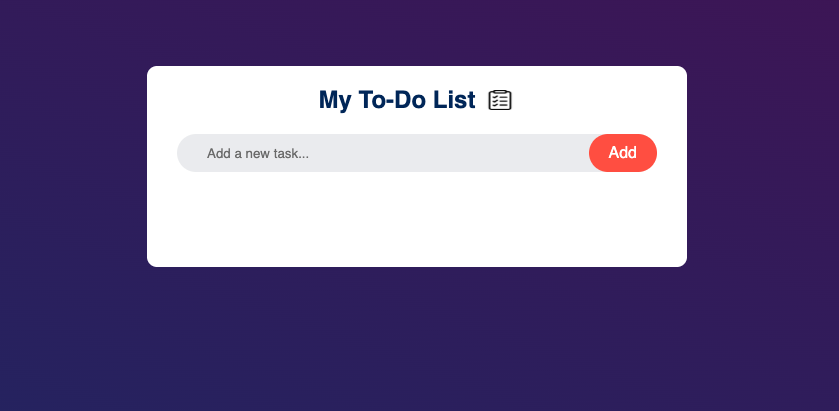
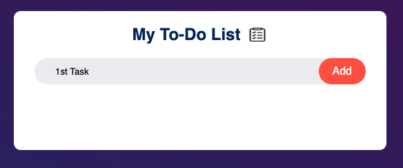
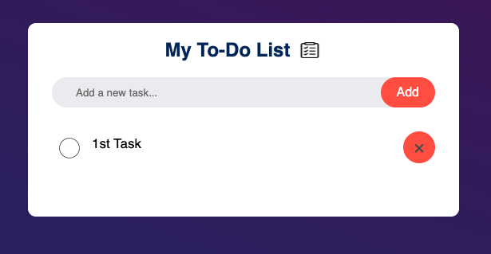
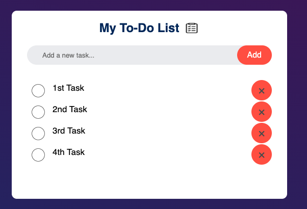
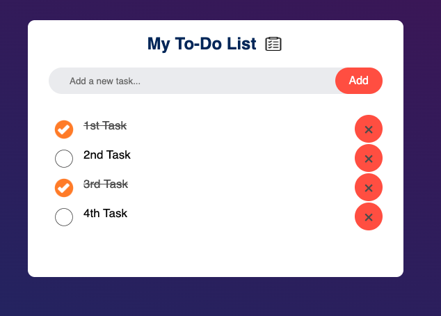
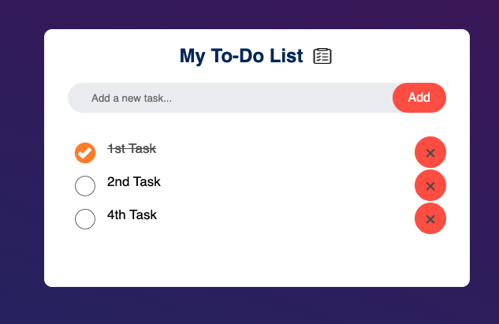

# 📝 To-Do List Web App

A simple and interactive **To-Do List** application built with **HTML, CSS, and Vanilla JavaScript**. This project helps users manage their daily tasks by allowing them to add, complete, delete, and save tasks using the browser's Local Storage.

## 🚀 Features

- ✅ Add new tasks
- ✔️ Mark tasks as completed
- ❌ Delete tasks
- 💾 Automatically save tasks using Local Storage
- 🔄 Load saved tasks after refreshing the page
- 📱 Responsive and clean user interface

## 📂 Project Structure

```
todo-list/
│
├── index.html
├── style.css
├── script.js
├── README.md
└── images/
    ├── check.png
    ├── uncheck.png
    └── to-do-list.png
```

## 🛠️ Technologies Used

- HTML5
- CSS3
- JavaScript (ES6)
- Local Storage API

## 📖 How It Works

### Add a Task
- Type a task into the input field.
- Click the **Add** button.
- The task will be added to the list.

### Complete a Task
- Click on any task.
- The task will be marked as completed.
- Click again to unmark it.

### Delete a Task
- Click the **×** button beside a task.
- The task will be removed immediately.

### Save Tasks
- Every change is automatically saved to the browser's Local Storage.

### Load Tasks
- When the page is reopened or refreshed, previously saved tasks are loaded automatically.

## 📸 Screenshot


Example:


  



## 🧠 JavaScript Concepts Practiced

- DOM Manipulation
- Event Handling
- Event Delegation
- Creating Dynamic HTML Elements
- Local Storage API
- Functions
- Conditional Statements
- CSS Class Manipulation

## ▶️ Getting Started

1. Clone this repository

```bash
git clone https://github.com/Md-Tanvir-Hossain/To-Do_List
```

2. Navigate to the project folder

```bash
cd todo-list
```

3. Open `index.html` in your browser.

No additional setup or dependencies are required.

## 🎯 Future Improvements

- ✏️ Edit existing tasks
- 🔍 Search tasks
- 📊 Task counter
- 📂 Filter tasks (All / Active / Completed)
- 🌙 Dark mode
- 🎨 Improved animations
- 📅 Due dates
- 🏷️ Task categories
- 📱 Better mobile responsiveness

## 📄 License

This project is open source and available under the **MIT License**.

---

**Author:** Md. Tanvir Hossain

Built as part of my JavaScript learning journey.